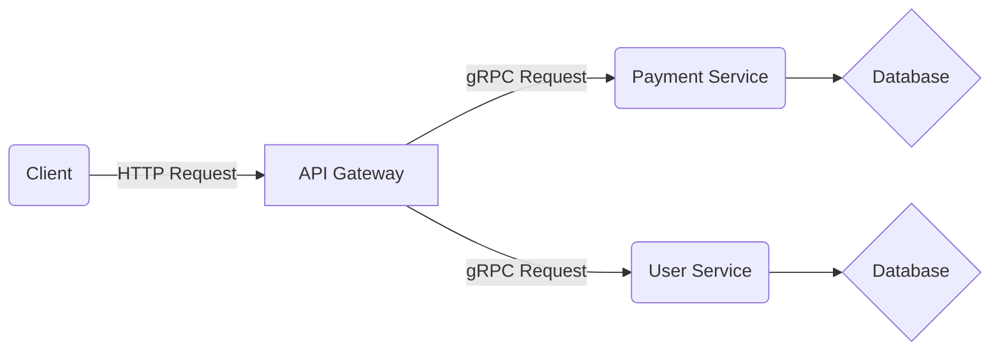

## Welcome to Clean  Commerce 

Clean Commerce is a microservices-based e-commerce platform that includes a <b>User Service</b> for user registration and managing, a <b>Payment Service</b> for managing billing addresses and card information, both operating with gRPC protocol.
<p>
And one <b>API Gateway</b> service to facilitates communication between these services, handling HTTP requests and routing them appropriately.
</p>
<p>
Currently, users can register, add billing addresses, and manage credit card information through the payment service, while authentication processes are in development to enhance security.
</p>

### Technologies and approaches

- GoLang,
- Mysql
- SQLc
- Automated tests
- gRPC
- Microsservices
- Clean Architecture

### Architecture

In this project, I decided to implements <b>Clean Architecture</b>, a software design philosophy that emphasizes separation of concerns, ensuring that the system's core logic is uncoupled from external frameworks, user interfaces, and databases, which promotes maintainability and testability.

I also decided to use a <b>microservices-based architecture</b> in the project, which structures the application as a collection of loosely coupled services, each responsible for specific business functions, enabling independent development, deployment, and scalability.

###   Installation
<p>To install the application, the docker and docker-compose must be installed correctly on your machine</p><p>The application will start on localhost <b>(127.0.0.1)</b> on <b>8000 port</b>, the mysql will start on <b>3306 port</b>, and the microsservices will use the <b>50051</b> and <b>50052</b> ports, make sure these ports are free before starting the installation.</p>
<p>1. Enter on project folder: </p>

```
cd clean_commerce
```
<p>2. Now we will run the containers using docker-compose:</p>  

```
docker-compose up
```
<p>3. Now we need to run the migrations with the following command: </p>

``` 
make migrate 
```
#### Troubleshooting issue
If you encounter issues during the installation of the project, it’s possible that the containers may fail to start due to database connectivity problems. In such cases, please try the following steps:

1.  Ensure that the database service is running correctly.
2.  Restart the containers using the following command:
```
docker-compose down
```
```
docker-compose up
```
### Testing

The following layers are covered by automated tests:

-   <b>Users Repository:</b> `services > users > internal > infra > database`
-   <b>Card and Billing  Address Entities</b>: `services > payment > internal > entity`
-   <b>Card and Billing Address Repository: </b> `services > payment > internal > infra > database`

To run the tests, in the `/clean_commerce` directory run the following command : 
``` 
make test
```

To test the functionality in practice, a Postman collection has been made available in the `/docs` directory.
<p>
[Click Here to check endpoints, requests and response](docs/README.md)
</p>